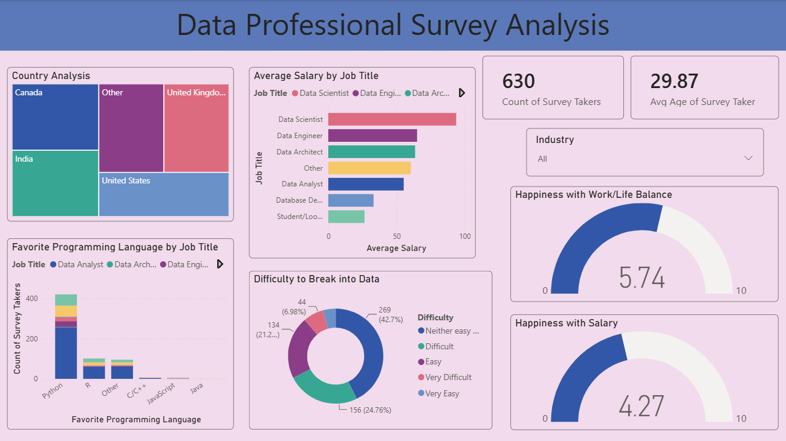

# 📊 Data Professional Survey Analysis

## Overview

This project is an interactive Power BI dashboard built using survey data from data professionals. It provides insights into salary trends, programming language preferences, job roles, work-life balance, and career satisfaction through interactive visualizations.

## Dashboard Preview

## Features & Visualizations

- Analyzed responses from 630 survey participants from an already available survey dataset.
- Treemap - Visualized country-wise distribution of survey respondents.
- Stacked column chart - Explored programming languages preferences by profession.
- Stacked bar chart - Compared average salaries across different data-related job roles.
- Donut chart - Analyzed how difficult respondents found it to enter the data industry.
- Cards - Displayed KPIs such as Count of Survey Takers and Average Age.
- Slicer - Filtered the data by industry.
- Gauges - Displayed KPIs such as Work-Life Balance Rating and Salary Satisfaction Rating.

## Key Insights

- Data Scientists reported the highest average salaries among all surveyed job roles.
- Python was the most preferred programming language across multiple data-related professions.
- Salary satisfaction was noticeably lower than work-life balance.
- Most participants found it moderately difficult to break into the data industry.
- The majority of survey responses came from the United States, followed by other countries.

## Tools & Technologies

- Microsoft Power BI
- Power Query
- DAX
- Microsoft Excel

## Skills Demonstrated

- Data Cleaning
- Data Transformation
- Data Visualization
- Dashboard Design
- Business Intelligence
- KPI Reporting
- DAX Measures
- Power Query
